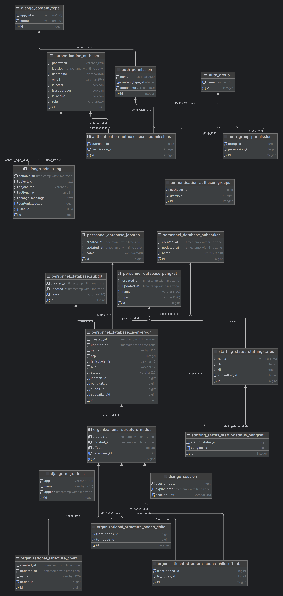

## **SISTEM INFORMASI PERSONEL (SINFOPERS) - Backend**  
**Human Resource Management System (HRMS) for Korps Lalu Lintas Polri**  

SINFOPERS adalah backend dari sistem manajemen sumber daya manusia (HRMS) yang dikembangkan menggunakan **Django** dan **Django REST Framework (DRF)** untuk meningkatkan transparansi, efisiensi, dan akurasi dalam pengelolaan personel di Korps Lalu Lintas Polri.  

### **🚀 Teknologi yang Digunakan**  
- **Backend**: Django, DRF  
- **Database**: PostgreSQL  
- **Autentikasi**: JWT  
- **Deployment**: Gunicorn, Nginx  

### **📌 Instalasi & Setup**  
```sh
git clone https://gitlab.cs.ui.ac.id/propensi-2024-2025-genap/kelas-b/b02-propensiu-be.git
cd b02-propensiu-be
python3 -m venv env
source env/bin/activate  # (Linux/macOS) | env\Scripts\activate (Windows)
pip install -r requirements.txt
python manage.py migrate
python manage.py runserver
```
### **Diagram Database**

