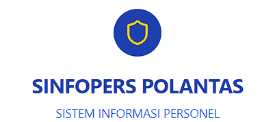
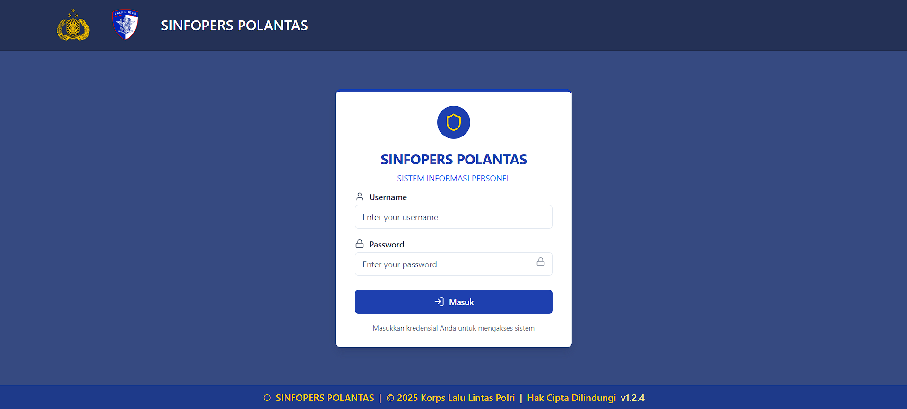

# B02 - PROPENSIU

## Authors

* **Syafri Barry Salime** - Lead Programmer
* **Thobyas Muda Parlindungan** - Project Manager
* **Ihza Dafa Maulidan** - Scrum Master
* **Nataya Shafira** - Lead System Analyst
* **Anandafa Syukur Rizky** - Lead Designer

 

## **SISTEM INFORMASI PERSONEL (SINFOPERS)**  
**Human Resource Management System (HRMS) for Korps Lalu Lintas Polri**  

SINFOPERS adalah backend dari sistem manajemen sumber daya manusia (HRMS) yang dikembangkan menggunakan **Django** dan **Django REST Framework (DRF)** untuk meningkatkan transparansi, efisiensi, dan akurasi dalam pengelolaan personel di Korps Lalu Lintas Polri.  

### **🚀 Teknologi yang Digunakan**  
- **Backend**: Django, DRF  
- **Database**: PostgreSQL  
- **Autentikasi**: JWT  
- **Deployment**: Gunicorn, Nginx  
- **Frontend**: React, TypeScript, Vite
- **State Management**: React Context API
- **Styling**: Tailwind CSS
- **Routing**: React Router
- **API Client**: Axios

**Final product** : https://sinfopers.netlify.app

**Promotional video** : https://youtu.be/IwvAD3qSoaU?si=IQhmBr4312Xhhykt

**Project link** : 
* Backend : https://gitlab.cs.ui.ac.id/propensi-2024-2025-genap/kelas-b/b02-propensiu-be.git
* Frontend : https://gitlab.cs.ui.ac.id/propensi-2024-2025-genap/kelas-b/b02-propensiu-fe.git
