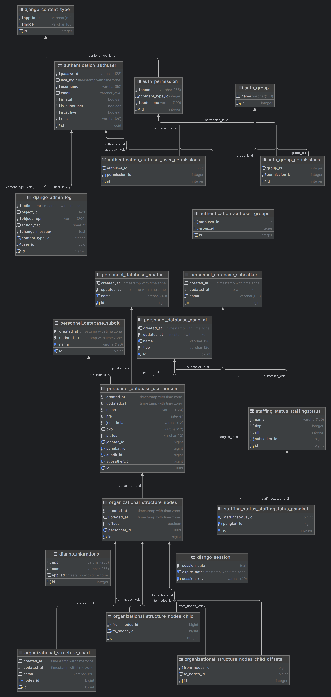

## **SISTEM INFORMASI PERSONEL (SINFOPERS) - Backend**  
**Human Resource Management System (HRMS) for Korps Lalu Lintas Polri**  

SINFOPERS adalah backend dari sistem manajemen sumber daya manusia (HRMS) yang dikembangkan menggunakan **Django** dan **Django REST Framework (DRF)** untuk meningkatkan transparansi, efisiensi, dan akurasi dalam pengelolaan personel di Korps Lalu Lintas Polri.  

### **🚀 Teknologi yang Digunakan**  
- **Backend**: Django, DRF  
- **Database**: PostgreSQL  
- **Autentikasi**: JWT  
- **Deployment**: Gunicorn, Nginx  

